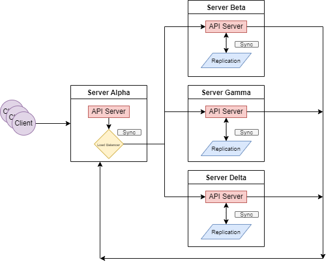

# A DISTRIBUTED IN MEMORY KEY-VALUE DATASTORE



The current work represents 100% of the _third_ laboratory work for the `PR` course at UTM.

## DONE

- [x] Data synchronization. Servers should periodically sync between them in order to ensure data entegrity.
- [x] Load balancing implementation. Partition leader have to distribute network requests for any data operation across the cluster service in order to prevent high load only on dedicated service.
- [x] File storage support by FTP and realtime communication by WebSockets.


## INSTALATION

The application uses docker containers and docker-compose to run multiple containers to simulate a cluster of nodes.

### LINUX/WINDOWS

1. Clone the repository.

```
git clone https://github.com/IuraCPersonal/distributed-datastore
```

2. Navigate inside the directory.

```
cd distributed-datastore
```

3. Make sure that Docker is running.

  - On _Windows_ start the Docker app.
  - On _Linux_ type in terminal:

    ```
    sudo systemctl start docker
    ```

4. Run docker compose to start the cluster.

  - On _Windows_:
    ```
    docker-compose up --build
    ```
  - On _Linux_:
    ```
    docker compose up build
    ```

## HOW TO USE

You can use either `Postman` or just the `curl` command. Here is an example of a request:

```bash
curl -i -X POST -H "Content-Type: application/json" -d '{"username":"s1mpi", "password":"faf"}' http://127.0.0.1:3000
```

To make use of the websockets, visit any desired server's URL on the `/client` endpoint.

## TASK

You have to develop distributed in memory datastore which could be used as a web service. `Redis` and `DynamoDB` are a
good examples of such datastores.

Your datastore have to be distributed, this means you should have at least 3 servers which stores the data. In memory data store represents just a store which holds data as cache without storing it in any dedicated storage such as SQL or NoSQL
database or any other storage.

Your data store has to be used as a web service, this means all data operations have to be performed as network requests. Datastore has to be able to perform __CRUD__ (Create, Read, Update, Delete) operations on data you provide.

The datastore is storing the data in distributed way, which means the data you provide could be stored in any of datastore partition cluster server. The idea here is to have multiple servers which stores provided data without exposing to the client how and where data is actually stored.

Accessing the data from datastore should return requested data in case it is store on any other partition cluster servers

## SYSTEM REQUIREMENTS

Your datastore have to be organized as a cluster. The cluster includes at least 3 servers which stores the data. One of the cluster server will play role of `Partion Leader`. At cluster start up, all servers will synchronize between and the cluster itself will decide who is partition leader and will provide the dedicated output message. The clients will communicate only with Partion

`Leader`, but under the hood it manages data distribution and load balancing of the whole cluster by communicating with other cluster servers.

Cluster itself represents the datastore and each server is just a part of this distributed datastore. In oder to keep the datastore fault tolerant, data have to be duplicated on multiple servers in such a way that even in case when half(50%) of the servers will be unavailable(shutdown), the datastore still will be capable for providing all the data, previously stored.

Periodically servers have to synchronize the data they storing in order to avoid any data corruptions as the same data could be duplicated on multiple servers.

Cluster servers have to communicate with each other using "low level" protocols, such as __TCP__ and/or __UDP__. It is up to you to decide which protocol for which scenario to use. You can use both TCP and UDP or just one of them. Cluster servers communication could be also implemented via __HTTP(S)__, but this will affect the final mark as it depends on the number of protocols you will implement(see also Grading system section).

Clients have to communicate with your datastore using higher level protocols. The main protocol to interact with datastore should be __HTTP(S)__. For more advanced use cases consider to use FTP for storing files and _WebSockets_ for real time data updates. _WebSockets_ have to be used for concurrent data sharing between multiple clients, when some client performs some data operations on the file, another client have to receive data updates through _WebSockets_.

## TESTING

I used `POSTMAN` to test the application. The covered cases are __GET__, __POST__ (same as UPDATE), __DELETE__.

The API requests can be made to the `Partion Leader` which will route them to every node, or to the individual nodes as well.

## REFERENCES

- [ ] [FlaskRESTful](https://flask-restful.readthedocs.io/en/latest/)

# CONTACT

If you have any question, please contact me through email: `iurie.cius@isa.utm.md`.